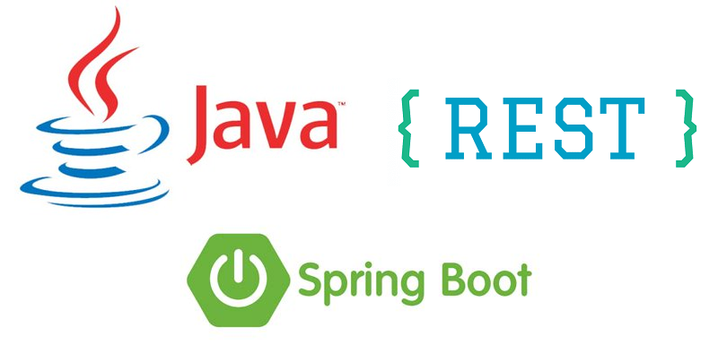

# How to build a REST API using Java and Spring Boot (a tutorial)

This is the source code of my tutorial on how to build a REST API with Java and Spring Boot.

You can check the complete articles at my [LinkedIn profile](https://www.linkedin.com/in/hsuguihura/) (English version) or at my [Medium page](https://hiiki.medium.com/) (Portuguese version).

---

>In this tutorial, we are going to create a step-by-step guide, with some detail, on how to develop a REST API using Java and Spring Boot. In this first part, we will introduce a theoretical content about REST and show which tools will be used in this project.

Continue reading [here](https://www.linkedin.com/pulse/rest-api-java-spring-boot-part-1-setting-up-henrique-suguihura/) (English) or [here](https://hiiki.medium.com/api-rest-com-java-e-spring-boot-parte-1-56d88e262ff5) (Portuguese).
